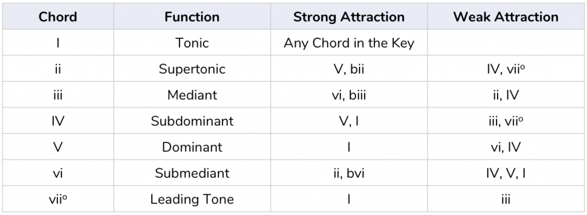
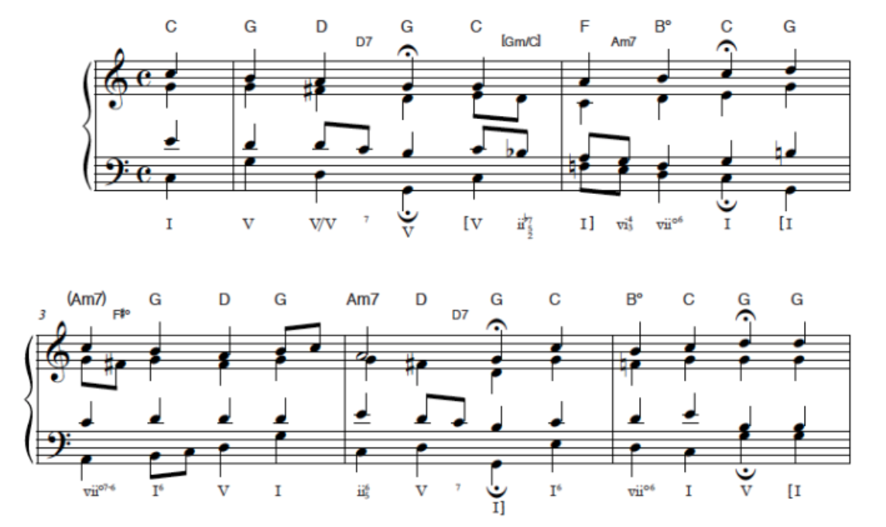

J.S. Bach through the Markov Chain
================
Miguel Ângelo Rebelo
17/12/2020

[NOTE: I still am not sure how to display graphs in here. They are in the .html file if you wish to take a look.]

# 1. Introduction

## 1.1 Markov Chains

Markov Chains (MC) are a class of stochastic processes, highly effective
at modelling categorical data sequences. Notable applications can be
found in linguistics, information theory, medicine, economics,
sociology, etc.

A MC is defined by a stochastic matrix known as transition matrix (TM),
which is a square matrix satisfying the equation:

*P*<sub>*i**j*</sub> ∈ \[0, 1\]∀*i**j*

∑<sub>*i*</sub>*P*<sub>*i**j*</sub> = 1

A MC is a stochastic process with a discrete set of states, {s1, s2, …,
sk}. The chain starts in a generic state at time zero (t<sub>0</sub>)
and moves from a state to another by steps. P<sub>ij</sub> is the
probability that a chain currently in state s<sub>i</sub> moves to state
s<sub>j</sub> at the next step, and this does not depend upon the
precious state in the chain. P<sub>ij</sub> is defined by a transition
matrix (TM), which has the transition probabilities.

The n<sub>th</sub> power of P is a matrix whose entries represent the
probabilities that a MC in state s<sub>i</sub> at time *t* will be in
state s<sub>j</sub> at time *t* + *n*.

Main properties of MC:

-   A state s<sub>i</sub> is reachable from state s<sub>j</sub> if
    $∃n\\to P\\binom{n}{ij}&gt;0$. If the inverse is also true, then
    s<sub>i</sub>and s<sub>j</sub> *communicate*.

-   There always exists a unique decomposition of the state space into a
    sequence of disjoint subsets in which all the states within each
    subset communicate (*communicating class*).

-   If it is impossible to leave a state s<sub>j</sub>, it is said to be
    absorbing, meaning P<sub>jj</sub> = 1. A chain with at least one
    *absorbing state* which can be reached is an *absorbing MC*, and the
    other states are defined as *transient states*. States that can be
    visited more than once are known as *recurrent states*.

-   If a MC contains r ≥ 1 *absorbing* states, it is possible to
    re-arrange their order by separating *t* *transient* and *r*
    *absorbing* states. Such re-arranged matrix is said to be in
    canonical form, where its composition can be represented by
    sub-matrices:

$$\[\\begin{array}(Q\_{tt}&R\_{tr}\\\\0\_{rt}&I\_{rr}\\end{array}\]$$

Such matrices are:

1.  Q, a sub-matrix containing the transition probabilities across
    *transient* states;

2.  R, a non-zero *t*-by-*r* matrix containing transition probabilities
    from non-absorbing to absorbing states;

3.  0, an *r*-by-*t* zero matrix;

4.  I, an *r*-by-*r* identity matrix.

-   These matrices can be used to compute structural properties of
    the MC. Since *l**i**m*<sub> → ∞</sub>*Q*<sub>*n*</sub> = 0, in
    every absorbing matrix the probability to eventually be absorbed is
    1, regardless of the initial state.

-   In the fundamental matrix N, the generic n<sub>ij</sub> entry
    expresses the expected number of times the process will transit in
    state s<sub>j</sub>, given that it started in state s<sub>i</sub>.

*N* = (*I* − *Q*)<sup> − 1</sup> = *I* + ∑<sub>*i* = 0, 1, ..., ∞</sub>*Q*<sup>*i*</sup>

-   The b<sub>ij</sub> entries of matrix *B* = *N* ∗ *R* are the
    probabilities that a MC started in state s<sub>i</sub> will
    eventually be absorbed in state s<sub>j</sub>.

-   The probability of visiting the transient state *j* when starting
    from the transient state *i* is the h<sub>ij</sub> entry of the
    matrix
    *H* = (*N* − *I*<sub>*t*</sub>) ∗ *N*<sub>*b**j*</sub><sup> − 1</sup>,
    being *dg* the diagonal operator.

## 1.2 J.S. Bach

As I write this part, I’m listening to the magnificent B Minor Mass by
J.S. Bach, a showcase of musical excellence, that I recommend the reader
to listen.

First, why Bach? J.S.Bach is know as the most prolific and ingenious
composers of all time. He was a master of counterpoint, where there are
lots of independent musical lines playing at the same time, forming a
complex and engaging texture. He explored every major style, form and
musical genre of its time.

He completed over a 1000 compositions! He composed hundreds of chorales
for organ, and many Toccatas, Fantasias, Preludes and Fugues. For
keyboard he wrote many works that demonstrate the possibility of playing
in every single key, which was unusual at the time. He also worked on
chamber music and solo pieces, where he developed a technique that
suggest harmony, so that it does not need to be accompanied by another
instrument. He also wrote some dramatic orchestral and vocal pieces. My
favourite works from him are from this category, namely St. John’s
Passion and the magnificent Mass in B Minor.

Bach’s music combined the artistic, emotional and intellectual
characteristics. The Baroque era was characterized by movement,
contrast, drama, detail and surprise. Although very rich, it constitutes
a great starting point for applying MC, since it is more complex than
modern pop music (more nodes) but not too crazy on the harmonic part as
the following eras (too many nodes). It is an example of beauty in
complexity.

## 1.3 Some jump start music theory

Why focus on harmony?

Checking the harmonic progressions is a good starting point of any
musical analysis. The focus on harmonic progressions reduces the
complexity associated with such a difficult and rich language as music.
The melody would be a wrong choice to start, since a good melody has
range, character, movement, rhythm and expressiveness. Nobody ears
single notes, we ear phrases, entire lines of notes that blend to tell
something. This is why it would be difficult to analyse melody.

No, some key notions before we proceed to the harmonic analysis:

-   Music is not a stochastic process, although it has elements of it.
    Harmonic progressions need to surprise but they have an internal
    logic. 

-   Each chord (from the I<sub>th</sub> to the VII<sub>th</sub>) as a
    specific function (creates a specific tension/release when combined
    with others)

-   They don’t jump randomly, it would not sound pleasing. They have
    different levels of attraction to other states.

-   Based on this, if we want to make a jump, this has to be
    “prepared”/“suggested” before.

And why focus on chorales for this work?

Well, they are easier to read and analyse then Canon or Fugues…

Before we jump to the harmonic analysis using MC, I leave below an
example of what I mean by harmonic analysis.



# 2. Harmonic Analysis

Before we get into it, we need to load the required packages.

``` r
library(markovchain)
library(readr)
library(igraph)
require(reshape2)
require(ggplot2)
```

We’ll get hands on with a dataset that has the harmonic structure for
some Bach’s chorales.

In this section, we’ll take a look at the chorale BWV 17.7 in A\_M
entitled *“Nun lob, mein Seel, den Herren”*, which means *“Now praise,
my soul, the Lord”*. This was chosen based on the number of chords it
has. We need to load and trim the dataset.

``` r
jsbach_chorals_harmony <- read_csv("jsbach_chorals_harmony.data", 
                                   col_names = FALSE)
BWV_17.7 = jsbach_chorals_harmony[jsbach_chorals_harmony$X1 == '000306b_',]
bwv177 = factor(BWV_17.7$X17)
head(bwv177)
```

    ## [1] A_M A_M A_M A_M A_M D_M
    ## Levels: A_M A#d B_m B_M C#M D_M D#d E_M E_M7 F#m F#m7

Then we can compute the transition matrix, with the harmonic transition
probabilities for this chorale.

``` r
TM = createSequenceMatrix(bwv177, toRowProbs = TRUE); TM
```

    ##      A#d       A_M       B_M B_m        C#M        D#d        D_M       E_M
    ## A#d  0.5 0.0000000 0.0000000 0.5 0.00000000 0.00000000 0.00000000 0.0000000
    ## A_M  0.0 0.6363636 0.0000000 0.0 0.09090909 0.00000000 0.09090909 0.1818182
    ## B_M  0.0 0.0000000 0.5454545 0.0 0.00000000 0.00000000 0.00000000 0.3636364
    ## B_m  0.0 0.5000000 0.0000000 0.5 0.00000000 0.00000000 0.00000000 0.0000000
    ## C#M  0.0 0.0000000 0.0000000 0.0 0.50000000 0.00000000 0.00000000 0.0000000
    ## D#d  0.0 0.0000000 0.5000000 0.0 0.00000000 0.50000000 0.00000000 0.0000000
    ## D_M  0.0 0.0000000 0.0000000 0.0 0.00000000 0.00000000 0.50000000 0.0000000
    ## E_M  0.0 0.1333333 0.1333333 0.0 0.00000000 0.06666667 0.00000000 0.5333333
    ## E_M7 0.0 1.0000000 0.0000000 0.0 0.00000000 0.00000000 0.00000000 0.0000000
    ## F#m  0.0 0.0000000 0.3333333 0.0 0.00000000 0.00000000 0.00000000 0.1666667
    ## F#m7 1.0 0.0000000 0.0000000 0.0 0.00000000 0.00000000 0.00000000 0.0000000
    ##            E_M7       F#m      F#m7
    ## A#d  0.00000000 0.0000000 0.0000000
    ## A_M  0.00000000 0.0000000 0.0000000
    ## B_M  0.09090909 0.0000000 0.0000000
    ## B_m  0.00000000 0.0000000 0.0000000
    ## C#M  0.00000000 0.5000000 0.0000000
    ## D#d  0.00000000 0.0000000 0.0000000
    ## D_M  0.00000000 0.5000000 0.0000000
    ## E_M  0.00000000 0.1333333 0.0000000
    ## E_M7 0.00000000 0.0000000 0.0000000
    ## F#m  0.00000000 0.3333333 0.1666667
    ## F#m7 0.00000000 0.0000000 0.0000000

Having the transition matrix ready, we can create the markovchain object
and plot the graph, with each node being each chord.

``` r
MC = as(TM, "markovchain")
#verify that it is a markovchain object
is(MC, 'markovchain')
```

    ## [1] TRUE

``` r
plot(MC, edge.arrow.size=0.45, main='BWV 17.7 Markov Chain')
```

<!-- -->

To keep in mind, since we are in A Major: A\_M (I), B (ii/II), C\#
(iii/III), D (IV/vii of the V), E (V), F\# (vi), G\# (vii).

A Major (I<sub>th</sub>) is strongly connected to its V<sub>th</sub>
(E\_M) and its vi<sub>th</sub> (F\#m), with and important contribution
from the IV<sub>th</sub> (D\_M). This makes sense, since these are the
most common chords from the chord attraction point of view: I-IV-vi-V-I.

Now we can define an initial state, beginning in A\_M, and check after 2
transitions:

``` r
#initial state
initial_state = c(0,1,0,0,0,0,0,0,0,0,0)
#2 transitions after
after_2_transitions = initial_state * (MC^2); after_2_transitions
```

    ##      A#d       A_M        B_M B_m       C#M        D#d       D_M       E_M E_M7
    ## [1,]   0 0.4292011 0.02424242   0 0.1033058 0.01212121 0.1033058 0.2126722    0
    ##            F#m F#m7
    ## [1,] 0.1151515    0

Lets check the number of states in our MC and its dimension.

``` r
#states
states(MC)
```

    ##  [1] "A#d"  "A_M"  "B_M"  "B_m"  "C#M"  "D#d"  "D_M"  "E_M"  "E_M7" "F#m" 
    ## [11] "F#m7"

``` r
#dimension
dim(MC)
```

    ## [1] 11

Now lets check the transition probabilities. An aesthetically pleasing
(and usual) transition I-V will probably occur, but we should not see an
ugly one (id-IV) in Bach (unless he was hallucinating while writing this
one).

``` r
#beautiful transition, probably it will occur
transitionProbability(MC, 'A_M', 'E_M')
```

    ## [1] 0.1818182

``` r
#ugly transition, probably it will not occur 
transitionProbability(MC, 'A#d', 'E_M')
```

    ## [1] 0

Ok, we’ve just checked that Bach was not crazy (probably).  
Now we can try and create a coral with 10, beginning in A\_M
(t<sub>0</sub>).

``` r
#create a coral with 10 harmonic transitions
markovchainSequence(10, MC, t0="A_M")
```

    ##  [1] "A_M" "E_M" "E_M" "E_M" "E_M" "E_M" "E_M" "E_M" "E_M" "E_M"

…So, it could be better, but surely Bach could make this sequence sound
nice.

``` r
#probability with DTMC: stationary distribution
## when the TM is irreducibile
df_MC = melt(data.frame(steadyStates(MC)))
ggplot(df_MC, aes(variable,value), ylim(c(0,0.3))) + geom_point(color='blue') + geom_text(aes(label=round(value, 4)), size=3, vjust=-2)
```

<!-- -->

Next we will check the MC for transient states, absorbing states,
recurrent and communicating classes. We can also check if F\#m is
accessible from E\_M7.

``` r
#classifying states
transientStates(MC)
```

    ## character(0)

``` r
absorbingStates(MC)
```

    ## character(0)

``` r
#identifying recurrent and transient classes
recurrentClasses(MC)
```

    ## [[1]]
    ##  [1] "A#d"  "A_M"  "B_M"  "B_m"  "C#M"  "D#d"  "D_M"  "E_M"  "E_M7" "F#m" 
    ## [11] "F#m7"

``` r
communicatingClasses(MC)
```

    ## [[1]]
    ##  [1] "A#d"  "A_M"  "B_M"  "B_m"  "C#M"  "D#d"  "D_M"  "E_M"  "E_M7" "F#m" 
    ## [11] "F#m7"

``` r
is.accessible(MC, from = "E_M7",to="F#m")
```

    ## [1] TRUE

``` r
summary(MC)
```

    ## Unnamed Markov chain  Markov chain that is composed by: 
    ## Closed classes: 
    ## A#d A_M B_M B_m C#M D#d D_M E_M E_M7 F#m F#m7 
    ## Recurrent classes: 
    ## {A#d,A_M,B_M,B_m,C#M,D#d,D_M,E_M,E_M7,F#m,F#m7}
    ## Transient classes: 
    ## NONE 
    ## The Markov chain is irreducible 
    ## The absorbing states are: NONE

``` r
period(MC)
```

    ## [1] 1

``` r
#converting to igraph
MC.igraph = as(MC,"igraph")
#finding and formatting the clusters
SCC = clusters(MC.igraph, mode="strong") 
V(MC.igraph)$color = rainbow(SCC$no)[SCC$membership]
#plotting
plot(MC.igraph, mark.groups = split(1:vcount(MC.igraph), SCC$membership), main="Communicating classes - strongly connected components")
```

<!-- -->

This MC is irreducible with only one recurrent class and no transient
classes. It also doesn’t have any transient or absorbing states. This is
pretty typical in music, since every transition is *nudged* (or
prepared) before it occurs and, although we can modulate to other
tonalities, most of the time we will keep some type of linkage between
the tonalities that make it possible to reach any previous state
(chord). Since
$\\sum\_{n=1}^{∞}2n\\frac{\\frac{1}{2n-1}{\\binom{2n}{n}}}{2^{2n}} = 1$
the probability of first return in finite time is 1, so this is
recurrent.

``` r
#first passage time
firstPassage(MC,state = "A_M",5)
```

    ##          A#d        A_M        B_M        B_m        C#M        D#d        D_M
    ## 1 0.00000000 0.63636364 0.00000000 0.00000000 0.09090909 0.00000000 0.09090909
    ## 2 0.00000000 0.02424242 0.02424242 0.00000000 0.05785124 0.01212121 0.05785124
    ## 3 0.00000000 0.01292929 0.07280073 0.00000000 0.03901828 0.01417815 0.03901828
    ## 4 0.01919192 0.01283379 0.09488850 0.00000000 0.02740766 0.01463127 0.02740766
    ## 5 0.02834099 0.01766047 0.09662890 0.00959596 0.02020999 0.01528560 0.02020999
    ##          E_M        E_M7        F#m       F#m7
    ## 1 0.18181818 0.000000000 0.00000000 0.00000000
    ## 2 0.11570248 0.000000000 0.11515152 0.00000000
    ## 3 0.08878037 0.002203857 0.13166208 0.01919192
    ## 4 0.08014214 0.007820352 0.11737479 0.02834099
    ## 5 0.07418943 0.012998728 0.09660371 0.02943595

The output of this function shows that the probability of the first hit
of state “E\_M” occurring at the first step is 0.18 and at second step
is 0.12.

In the next section we will pick the BWV 40.8 (originally in F minor but
in E minor on this dataset) entitled *Freuet euch, ihr Christen alle*,
which means *Rejoice, all you Christians*, and it is meant to be played
in the 2nd day of Christmas. For this exercise, suppose that Bach hit
his head before finishing this chorale. As a result, he added some (I’m
pretty sure) nonsense chords that conferred a horrendous ending to this
piece, as follows:

``` r
bwv2 = jsbach_chorals_harmony[jsbach_chorals_harmony$X1 == '000408b_',]
bwv2 = bwv2$X17
bwv2 = factor(append(bwv2, c('E_m','C_M', 'A_m', 'D_M', 'G_m', 'Eb_M', 'C_m', 'Eb_M', 'G_m', 'G#_M', 'G#_M')))

TM2 = createSequenceMatrix(bwv2, toRowProbs = TRUE)
MC2 = as(TM2, 'markovchain')
summary(MC2)
```

    ## Unnamed Markov chain  Markov chain that is composed by: 
    ## Closed classes: 
    ## G#_M 
    ## Recurrent classes: 
    ## {G#_M}
    ## Transient classes: 
    ## {A_m,A_m6,B_M,B_M7,B_m,C#d,C_M,D#d,D_M,E_M,E_m,F#M,F#M7,G_M},{C_m,Eb_M,G_m}
    ## The Markov chain is not irreducible 
    ## The absorbing states are: G#_M

This time, the MC is not irreducible. We have an absorbing state G\#\_M
(one that was added), that is both a closed and recurrent class. Now we
have two transient classes, one from the original piece (the strongly
connected part), and the one that was added. We can see this more
clearly in the graph:

<!-- -->

Now that we saw the effect of the addition in the graph, next we compute
the Q, R and I matrices, plus the fundamental matrix.

``` r
#The following function returns the Q, R, and I matrices
extractMatrices = function(mcObj) {
require(matlab)
mcObj = canonicForm(object = mcObj)
  #get the indices of transient and absorbing
transIdx = which(states(mcObj) %in% transientStates(mcObj)) #transient indexes
absIdx = which(states(mcObj) %in% absorbingStates(mcObj)) #absorbing indexes
  #get the Q, R and I matrices
Q = as.matrix(mcObj@transitionMatrix[transIdx,transIdx]) 
R = as.matrix(mcObj@transitionMatrix[transIdx,absIdx])
I = as.matrix(mcObj@transitionMatrix[absIdx, absIdx])
#get the fundamental matrix
N = solve(eye(size(Q)) - Q)
#computing final absortion probabilities 
NR = N %*% R
#return
out = list(
    canonicalForm = mcObj,
    Q = Q,
    R = R,
    I = I,
    N = N,
    NR = NR)
  return(out)
}

#decompose the matrix
MC2_dec = extractMatrices(mcObj = MC2)

#showing the fundamental matrix
MC2_fund = MC2_dec$N; MC2_fund
```

    ##           A_m     A_m6       B_M     B_M7       B_m       C#d      C_M C_m
    ## A_m  5.664737 6.359825  8.204414 8.246020  7.329474 0.9161843 2.817294   1
    ## A_m6 4.013507 9.342338 10.819103 8.277858  8.027014 1.0033767 3.028944   1
    ## B_M  4.013507 7.009005 10.819103 8.277858  8.027014 1.0033767 3.028944   1
    ## B_M7 4.067535 7.045023  9.095514 9.389291  8.135070 1.0168837 3.144718   1
    ## B_m  3.679477 6.415948  9.260974 7.755588 10.914509 1.3643137 2.789355   1
    ## C#d  3.261939 5.674626  7.313314 7.102750  6.523878 1.8154848 2.489870   1
    ## C_M  4.523718 7.488034  9.247829 8.392668  7.714102 0.9642627 3.943681   1
    ## C_m  0.000000 0.000000  0.000000 0.000000  0.000000 0.0000000 0.000000   3
    ## D#d  3.881492 6.782106  9.325253 7.943078  9.096318 1.1370397 2.924626   1
    ## D_M  3.261939 5.674626  7.313314 7.102750  6.523878 0.8154848 2.489870   1
    ## E_M  3.881492 6.782106  9.325253 7.943078  9.096318 1.1370397 2.924626   1
    ## E_m  4.000000 7.000000  9.000000 8.000000  8.000000 1.0000000 3.000000   1
    ## Eb_M 0.000000 0.000000  0.000000 0.000000  0.000000 0.0000000 0.000000   2
    ## F#M  3.762984 6.564212  9.650507 7.886155 10.192635 1.2740794 2.849252   1
    ## F#M7 3.679477 6.415948  9.260974 7.755588 10.914509 1.3643137 2.789355   1
    ## G_M  3.892909 6.761939  8.719971 8.654124  7.785818 0.9732272 2.984805   1
    ## G_m  0.000000 0.000000  0.000000 0.000000  0.000000 0.0000000 0.000000   1
    ##            D#d D_M      E_M      E_m Eb_M      F#M     F#M7      G_M G_m
    ## A_m  0.8932706   9 2.886035 22.33177    2 12.82658 1.832369 10.86602   2
    ## A_m6 0.9971056   9 3.047757 24.92764    2 14.04727 2.006753 11.02123   2
    ## B_M  0.9971056   9 3.047757 24.92764    2 14.04727 2.006753 11.02123   2
    ## B_M7 0.9855282   9 3.238784 24.63821    2 14.23637 2.033767 11.10613   2
    ## B_m  0.9099534   9 2.819103 22.74883    2 16.76706 2.728627 10.84553   2
    ## C#d  0.8010130   9 2.533285 20.02533    2 11.41679 1.630970 10.62590   2
    ## C_M  0.9472986   9 2.994573 23.68247    2 13.49968 1.928525 11.69203   2
    ## C_m  0.0000000   0 0.000000  0.00000    4  0.00000 0.000000  0.00000   2
    ## D#d  1.9658707   9 4.438133 24.14677    2 15.91856 2.274079 10.94473   2
    ## D_M  0.8010130   9 2.533285 20.02533    2 11.41679 1.630970 10.62590   2
    ## E_M  0.9658707   9 4.438133 24.14677    2 15.91856 2.274079 10.94473   2
    ## E_m  1.0000000   9 3.000000 25.00000    2 14.00000 2.000000 11.00000   2
    ## Eb_M 0.0000000   0 0.000000  0.00000    4  0.00000 0.000000  0.00000   2
    ## F#M  0.9317414   9 2.876266 23.29354    2 17.83711 2.548159 10.88945   2
    ## F#M7 0.9099534   9 2.819103 22.74883    2 16.76706 3.728627 10.84553   2
    ## G_M  0.9515195   9 3.049928 23.78799    2 13.62518 1.946454 13.18886   2
    ## G_m  0.0000000   0 0.000000  0.00000    2  0.00000 0.000000  0.00000   2

The calculated fundamental matrix shows that the number of times the
chain is in state G\_m, starting from state A\_m is two.

``` r
#expected number of steps before being absorbed 
MC2_fund%*%rep(1,17)
```

    ##           [,1]
    ## A_m  105.17398
    ## A_m6 114.55990
    ## B_M  112.22656
    ## B_M7 112.13282
    ## B_m  112.99927
    ## C#d   95.21515
    ## C_M  111.01887
    ## C_m    9.00000
    ## D#d  114.77805
    ## D_M   94.21515
    ## E_M  113.77805
    ## E_m  110.00000
    ## Eb_M   8.00000
    ## F#M  114.55609
    ## F#M7 113.99927
    ## G_M  110.32272
    ## G_m    5.00000

Also, the N ∗ 1 vector indicates that, if the chains starts in C\_m, the
expected number of steps before being absorbed is 9.

``` r
#calculating B matrix
#the probability to being absorbed in G#_M state as a function of the starting transient state
MC2_B = MC2_fund%*%MC2_dec$R; MC2_B
```

    ##      [,1]
    ## A_m     1
    ## A_m6    1
    ## B_M     1
    ## B_M7    1
    ## B_m     1
    ## C#d     1
    ## C_M     1
    ## C_m     1
    ## D#d     1
    ## D_M     1
    ## E_M     1
    ## E_m     1
    ## Eb_M    1
    ## F#M     1
    ## F#M7    1
    ## G_M     1
    ## G_m     1

Since there is only one absorbing state, G\#\_M, the probability to be
absorbed in G\#\_M is one, whichever the starting transient state is.

``` r
#calculating H, probability of visiting transient state j starting in transient state i
MC2_H = (MC2_fund - matlab::eye(ncol(MC2_fund))) * solve(diag(diag(MC2_fund))); MC2_H
```

    ##            A_m      A_m6       B_M      B_M7       B_m       C#d       C_M
    ## A_m  0.8234693 0.0000000 0.0000000 0.0000000 0.0000000 0.0000000 0.0000000
    ## A_m6 0.0000000 0.8929604 0.0000000 0.0000000 0.0000000 0.0000000 0.0000000
    ## B_M  0.0000000 0.0000000 0.9075709 0.0000000 0.0000000 0.0000000 0.0000000
    ## B_M7 0.0000000 0.0000000 0.0000000 0.8934957 0.0000000 0.0000000 0.0000000
    ## B_m  0.0000000 0.0000000 0.0000000 0.0000000 0.9083788 0.0000000 0.0000000
    ## C#d  0.0000000 0.0000000 0.0000000 0.0000000 0.0000000 0.4491829 0.0000000
    ## C_M  0.0000000 0.0000000 0.0000000 0.0000000 0.0000000 0.0000000 0.7464298
    ## C_m  0.0000000 0.0000000 0.0000000 0.0000000 0.0000000 0.0000000 0.0000000
    ## D#d  0.0000000 0.0000000 0.0000000 0.0000000 0.0000000 0.0000000 0.0000000
    ## D_M  0.0000000 0.0000000 0.0000000 0.0000000 0.0000000 0.0000000 0.0000000
    ## E_M  0.0000000 0.0000000 0.0000000 0.0000000 0.0000000 0.0000000 0.0000000
    ## E_m  0.0000000 0.0000000 0.0000000 0.0000000 0.0000000 0.0000000 0.0000000
    ## Eb_M 0.0000000 0.0000000 0.0000000 0.0000000 0.0000000 0.0000000 0.0000000
    ## F#M  0.0000000 0.0000000 0.0000000 0.0000000 0.0000000 0.0000000 0.0000000
    ## F#M7 0.0000000 0.0000000 0.0000000 0.0000000 0.0000000 0.0000000 0.0000000
    ## G_M  0.0000000 0.0000000 0.0000000 0.0000000 0.0000000 0.0000000 0.0000000
    ## G_m  0.0000000 0.0000000 0.0000000 0.0000000 0.0000000 0.0000000 0.0000000
    ##            C_m       D#d       D_M     E_M  E_m Eb_M       F#M      F#M7
    ## A_m  0.0000000 0.0000000 0.0000000 0.00000 0.00 0.00 0.0000000 0.0000000
    ## A_m6 0.0000000 0.0000000 0.0000000 0.00000 0.00 0.00 0.0000000 0.0000000
    ## B_M  0.0000000 0.0000000 0.0000000 0.00000 0.00 0.00 0.0000000 0.0000000
    ## B_M7 0.0000000 0.0000000 0.0000000 0.00000 0.00 0.00 0.0000000 0.0000000
    ## B_m  0.0000000 0.0000000 0.0000000 0.00000 0.00 0.00 0.0000000 0.0000000
    ## C#d  0.0000000 0.0000000 0.0000000 0.00000 0.00 0.00 0.0000000 0.0000000
    ## C_M  0.0000000 0.0000000 0.0000000 0.00000 0.00 0.00 0.0000000 0.0000000
    ## C_m  0.6666667 0.0000000 0.0000000 0.00000 0.00 0.00 0.0000000 0.0000000
    ## D#d  0.0000000 0.4913196 0.0000000 0.00000 0.00 0.00 0.0000000 0.0000000
    ## D_M  0.0000000 0.0000000 0.8888889 0.00000 0.00 0.00 0.0000000 0.0000000
    ## E_M  0.0000000 0.0000000 0.0000000 0.77468 0.00 0.00 0.0000000 0.0000000
    ## E_m  0.0000000 0.0000000 0.0000000 0.00000 0.96 0.00 0.0000000 0.0000000
    ## Eb_M 0.0000000 0.0000000 0.0000000 0.00000 0.00 0.75 0.0000000 0.0000000
    ## F#M  0.0000000 0.0000000 0.0000000 0.00000 0.00 0.00 0.9439371 0.0000000
    ## F#M7 0.0000000 0.0000000 0.0000000 0.00000 0.00 0.00 0.0000000 0.7318048
    ## G_M  0.0000000 0.0000000 0.0000000 0.00000 0.00 0.00 0.0000000 0.0000000
    ## G_m  0.0000000 0.0000000 0.0000000 0.00000 0.00 0.00 0.0000000 0.0000000
    ##            G_M G_m
    ## A_m  0.0000000 0.0
    ## A_m6 0.0000000 0.0
    ## B_M  0.0000000 0.0
    ## B_M7 0.0000000 0.0
    ## B_m  0.0000000 0.0
    ## C#d  0.0000000 0.0
    ## C_M  0.0000000 0.0
    ## C_m  0.0000000 0.0
    ## D#d  0.0000000 0.0
    ## D_M  0.0000000 0.0
    ## E_M  0.0000000 0.0
    ## E_m  0.0000000 0.0
    ## Eb_M 0.0000000 0.0
    ## F#M  0.0000000 0.0
    ## F#M7 0.0000000 0.0
    ## G_M  0.9241784 0.0
    ## G_m  0.0000000 0.5

Also, matrix H shows that the probability that a chain in state E\_m
will eventually visit again state E\_m is 0.96.

It is not irreducible,

``` r
period(MC2)
```

    ## Warning in period(MC2): The matrix is not irreducible

    ## [1] 0

and since we have an absorbing state:

``` r
steadyStates(MC2)
```

    ##      A_m A_m6 B_M B_M7 B_m C#d C_M C_m D#d D_M E_M E_m Eb_M F#M F#M7 G#_M G_M
    ## [1,]   0    0   0    0   0   0   0   0   0   0   0   0    0   0    0    1   0
    ##      G_m
    ## [1,]   0

The relevance of the chords in the transient classes is completely lost.
To have a clear picture of the long term behaviour of our process, we
can correct it by introducing a damping factor 0 &lt; α &lt; 1. Given
the transition matrix **TM2** for a network with *n* nodes, the Google’s
surfer matrix **G** is given by:

*G* = *α* \* *T**M*2 + (1 − *α*) \* *R*

with R being the matrix with all entries equal to 1/n.

``` r
#create R matrix
R = ifelse(TM2<1000,1/dim(MC2))
#apply damping factor
dampened = 0.85*TM2+(1-0.85)*R
dampened = as(dampened, 'markovchain')
df_damp = data.frame(steadyStates(dampened))
df_damp = melt(df_damp)
df_damp$SS = c('dampened')

#stationary distribution
steadyStates(dampened)
```

    ##             A_m       A_m6        B_M       B_M7        B_m        C#d
    ## [1,] 0.03410789 0.04715298 0.05934694 0.05485239 0.06061467 0.01477364
    ##             C_M        C_m       D#d        D_M        E_M       E_m       Eb_M
    ## [1,] 0.02343753 0.02840674 0.0129714 0.06675866 0.03514478 0.1364137 0.04723155
    ##             F#M       F#M7      G#_M        G_M        G_m
    ## [1,] 0.09401818 0.02121395 0.1539054 0.07493779 0.03471172

``` r
#without modification
bwv2_wo = jsbach_chorals_harmony[jsbach_chorals_harmony$X1 == '000408b_',]
bwv2_wo = bwv2_wo$X17
TM2_wo = createSequenceMatrix(bwv2_wo, toRowProbs = TRUE)
MC2_wo = as(TM2_wo, 'markovchain')
original_df = melt(data.frame(steadyStates(MC2_wo)))
original_df$SS = c('original')

#bind the two
df_all = rbind(original_df, df_damp)

#plot
ggplot(df_all, aes(variable,value, color=SS), ylim(c(0,0.15))) + geom_point()
```

<!-- -->

This way, we can recover the information regarding the relevance of the
nodes in the original chorale, which was completely lost when Bach hit
is head and added the obscure harmonization in the end of this piece.

# 3. Conclusion


# 4. References

Howard M.Taylor, Samuel Karlin; An Introduction to Stochastic Modelling.
3rd Edition. The markovchain Package: A Package for Easily Handling
Discrete Markov Chains in R. G.A. Spedicato, T.S. Kang, S.B. Yalamanchi,
D. Yadav, I. Cordón.
